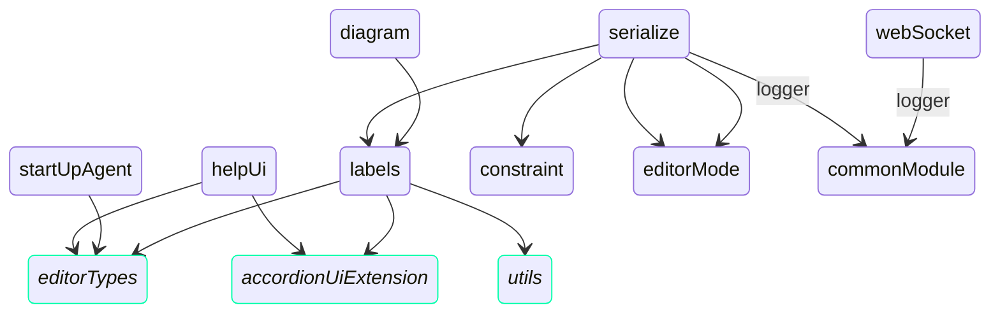

```mermaid
stateDiagram-v2

    
    helpUi --> accordionUiExtension
    helpUi --> editorTypes
    startUpAgent --> editorTypes
    labels --> utils
    labels --> editorTypes
    labels --> accordionUiExtension

    serialize --> labels
    serialize --> constraint
    serialize --> editorMode
    serialize --> commonModule: logger

    serialize --> editorMode
    
    diagram --> labels

    webSocket --> commonModule: logger

%%    [*] --> commonModule
%%    [*] --> labels
%%    [*] --> serialize
%%    [*] --> editorMode
%%    [*] --> diagram
%%    [*] --> webSocket
%%    [*] --> helpUi
%%    [*] --> startUpAgent

    classDef diLess font-style:italic,stroke:#0fa
    class accordionUiExtension,editorTypes,utils diLess
```

green packages do not export a module